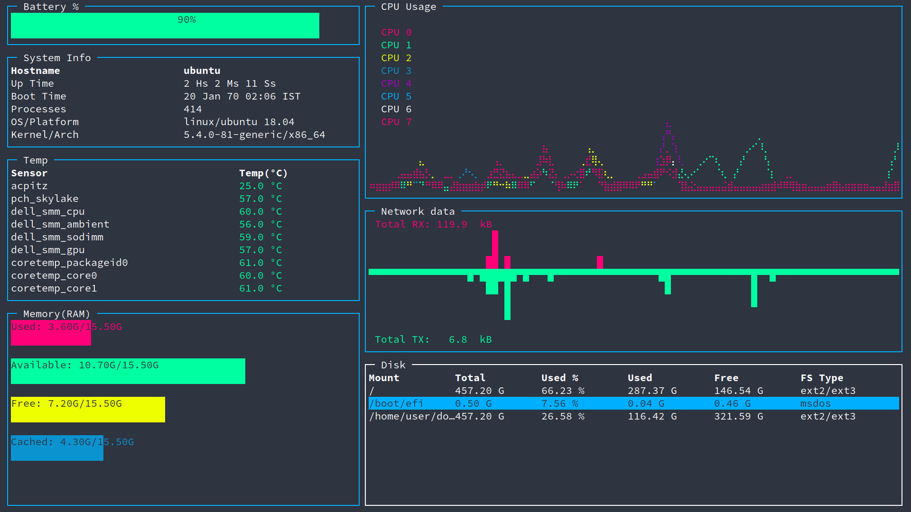
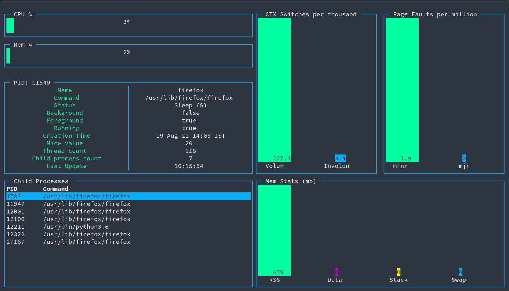

Grofer
======


A clean system monitor and profiler written purely in golang using [termui](https://github.com/gizak/termui) and [gopsutil](https://github.com/shirou/gopsutil)!

Installation
------------

Using go get:

```
go get -u github.com/pesos/grofer
```

Building from source:

```
git clone https://github.com/pesos/grofer
cd grofer
go build grofer.go
```

Usage
-----

```
grofer is a system profiler written in golang

Usage:
  grofer [flags]
  grofer [command]

Available Commands:
  about       about is a command that gives information about the project in a cute way
  help        Help about any command
  proc        proc command is used to get per-process information

Flags:
      --config string   config file (default is $HOME/.grofer.yaml)
  -h, --help            help for grofer
  -r, --refresh int32   Overall stats UI refreshes rate in milliseconds greater than 1000 (default 1000)
  -t, --toggle          Help message for toggle

Use "grofer [command] --help" for more information about a command.

```

Examples
--------

## `grofer [-r refreshRate]`

This gives overall utilization stats refreshed every `refreshRate` milliseconds. Default and minimum value of the refresh rate is `1000 ms`.



Information provided:  
- CPU utilization per core  
- Memory (RAM) usage  
- Network usage  
- Disk storage

---
## `grofer proc [-p PID] [-r refreshRate]`

If the `-r` flag is specified then the UI will refresh and display new information every `refreshRate` milliseconds. The minimum and default value for `refreshRate` is `1000 ms`.  

### `grofer proc [-r refreshRate]`

This lists all running processes and relevant information.


---

### `grofer proc -p PID [-r refreshRate]`

This gives information specific to a process, specified by a valid PID.



Information provided:  
 - CPU utilization %  
 - Memory utilization %  
 - Child processes  
 - Number of voluntary and involuntary context switches  
 - Memory usage (RSS, Data, Stack, Swap)
